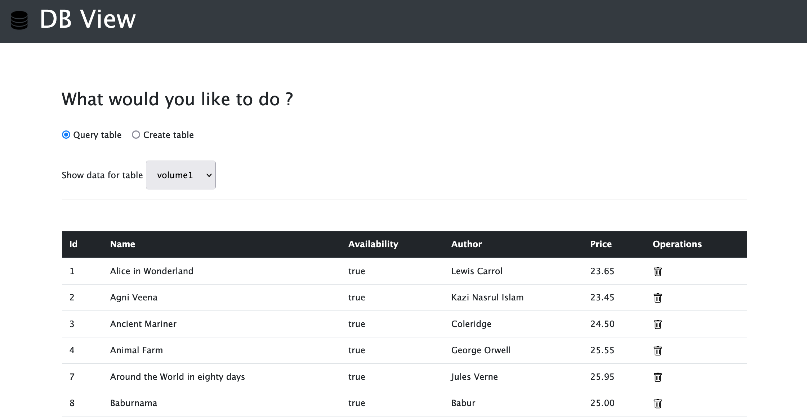

# DBView Project

## Description 
  
*The what, why, and how:* 
  
We all look for improving our technical skills. This is a simple project to see and modify the data in an underlying database 

The database used in for the first version is SQLITE3. This can be further enhanced for other databases as required with minimal changes.

## Table of Contents
* [Installation](#installation)
* [Usage](#usage)
* [Methodology](#methodology)
* [License](#license)
  

## Installation

Clone the project to a local folder and then run `npm install` in order to install the following npm package dependencies as specified in the `package.json`:
  * [`express`](https://www.npmjs.com/package/express) to easily create the REST API and views 
  * [`jade`](https://www.npmjs.com/package/jade) to write easy and fast HTML code
  * [`sqlite3`](https://www.npmjs.com/package/sqlite3) for a simple database.

The application itself can be invoked with `npm start`.

## Usage 

*Instructions and examples for use:*

When you run `npm start`, the application uses the `express` package to start up the web application. 

Use the below link once the application is up and running in your local system.
http://localhost:3000/viewTable

## Methodology

The application utilizes NodeJS and Express features to create simple REST API and the views to interact with the API.

## License

MIT License

---

## Questions?

Feel free to contact me with examples or any questions via the information below:

GitHub: [@pv1823](https://api.github.com/users/pv1823)

Email: pv1823@gmail.com
